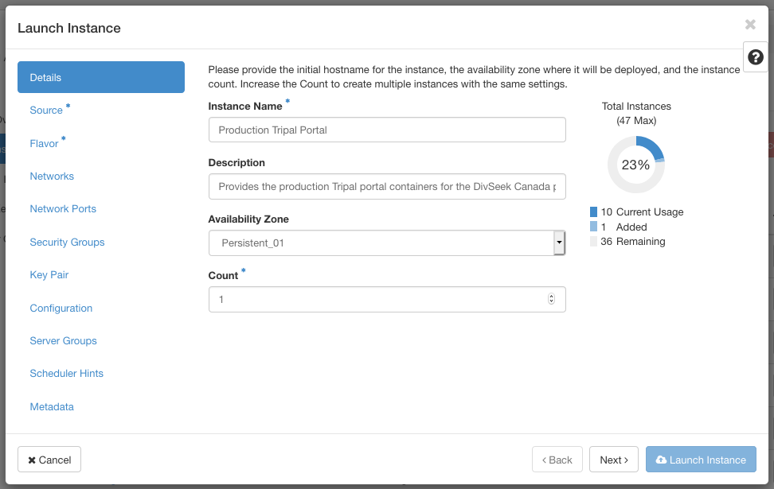
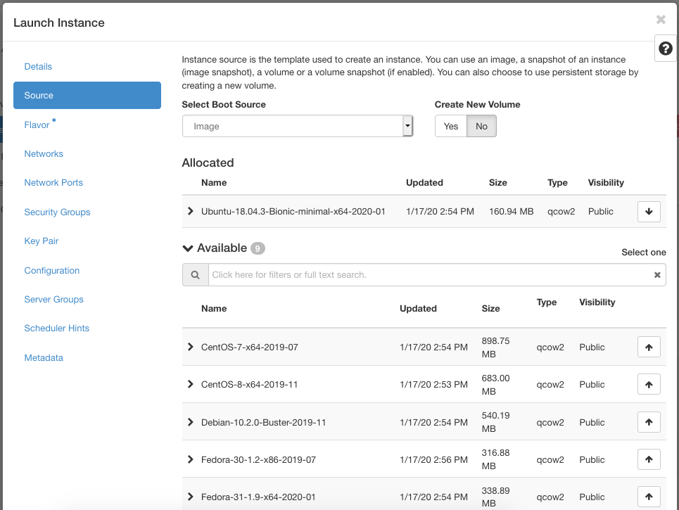
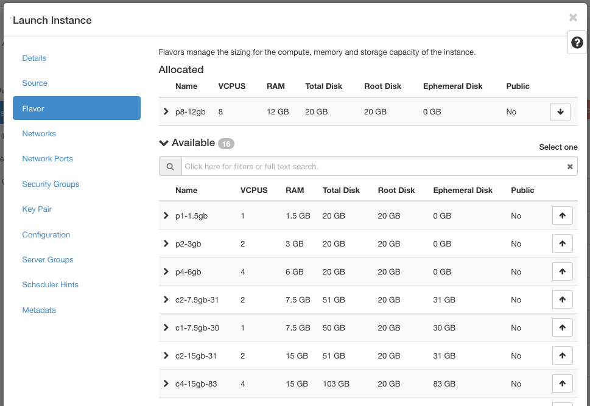
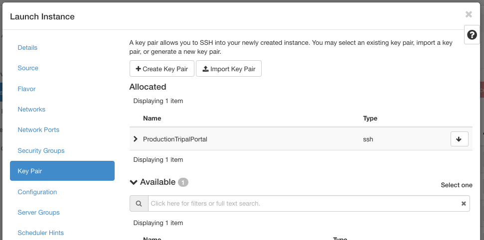
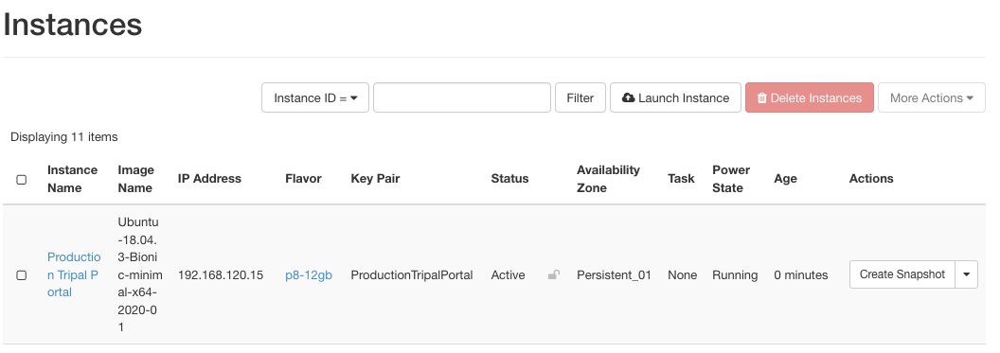

We have chosen to host the main DivSeek Canada portal on the ComputeCanada Cloud. To do so for your portal, first request an allocation which based on the platform requirements listed on the parent page. The following steps indicate how to prepare your allocation for your own portal.

Create the Cloud Instance
---------------------------

This guide will walk you through how to create an instance with the following:

- a persistent p4-6gb (4 core, 6 GB RAM)
- at least 20GB hard-drive space to store the docker image/container
- open all TCP/IP ports exposed by the various docker instances
- a Linux operating system
- connected to your pre-existing network
- a keypair in place to access the instance remotely.

1. Login to your cloud portal and access the instance dashboard by clicking on instances in the side menu.
2. At the top of the instance listing, click "Launch Instance" to create a new instance for your portal.
3. Fill out the name and description and choose an availability zone indicating persistent storage.
  

4. Select a source image to provision your instance. This should be a linux operating system (i.e. Ubuntu, Debian, Redhat, Centos).
  

5. The flavour indicates the machine stats your instance will have. Choose at least persistent p4-6gb (4 core, 6 GB RAM with 20GB storage space) or higher.
  

6. For networks, select an already set-up network. Networks can be set-up ahead of time by clicking on the networks tab on the side menu. **MORE DETAILS NEEDED**. Since you have chosen a network, you do not need to choose network ports.
7. Choose security groups which expose the ports required by the docker images you are launching. **MORE DETAILS NEEDED**.
8. Create a keypair specific to this instance to provide SSH command-line access to the instance and make sure it is allocated.
  

    It is very important you keep the private key generated as it will be needed for command-line administrative access to your instance. Login using SSH to your root allocation and navigate into the .ssh directory. Then copy the private key into a file named after your instance with no spaces and the .pem ending. This can be done using the following command (filling in your private key and instance name as indicated.):

    ```
    echo "<your private key" > [instance name].pem
    chmod 400 [instance name].pem
    ```

9. Finally, click "Launch Instance". This will launch the scheduler to create the instance and then build it. When it is complete your instance should be added to the list.
  

10. To connect to your instance, first SSH into your allocation. Then use your key you created and floating IP address assigned above. For example,
    ```
    ssh -i .ssh/tripal-production-portal.pem ubuntu@192.168.120.15
    ```

Docker Image and Volume Storage
---------------------------------

By default, the Docker image/volume cache (and other metadata) resides under /var/lib/docker which will end up being hosted on the root volume of a cloud image, which may be relatively modest in size. To avoid "out of file storage" messages, which related to limits in inode and actual byte storage, it is advised that you remap (and copy the default contents of) the /var/lib/docker directory onto an extra mounted storage volume (which should be configured to be automounted by fstab configuration).

In effect, it is generally useful to host the entire portal and its associated docker storage volumes on such an extra mounted volume. We generally use the /opt subdirectory as the target of the mount, then directly install various code and related subdirectories there, including the physical target of a symbolic link to the /var/lib/docker subdirectory. You will generally wish to set this latter symbolic link first before installing Docker itself (here we assume that docker has not yet been installed (let alone running).

In Compute Canada, using the OpenStack dashboard, a cloud "Volume" can be created and attached to a running DivSeek Canada Portal cloud server instance. We suggest creating a volume at least 200 GB in size (to allow for significant genomic data storage). After attaching the volume to the instance, the volume is initialized and mounted from within an SSH terminal session, as follows (where '$' is the Linux Bash CLI terminal prompt):

```
# Before starting, make sure that the new volume (here, 'vdb') is visible (should be!)
# NAME    MAJ:MIN RM  SIZE RO TYPE MOUNTPOINT
# vda     254:0    0  2.2G  0 disk
# ├─vda1  254:1    0  2.1G  0 part /
# ├─vda14 254:14   0    4M  0 part
# └─vda15 254:15   0  106M  0 part /boot/efi
# vdb     254:16   0  200G  0 disk

# First, initialize the filing system on the new, empty, raw volume (assumed here to be on /dev/vdb)
sudo mkfs -t ext4 /dev/vdb

# Mount the new volume in its place (we assume that the folder '/opt' already exists)
sudo mount /dev/vdb /opt

# Provide a symbolic link to the future home of the docker storage subdirectories
sudo mkdir /opt/docker
sudo chmod go-r /opt/docker

# It is assumed that /var/lib/docker doesn't already exist.
# Otherwise, you'll need to delete it first, then create the symlink
sudo ln -s /opt/docker /var/lib
```

It is also recommended that a separate additional volume for each crop dataset deployed be created, following the above instructions. A 500 GB volume is likely to be needed for this given the genomic large data sets involved. Also, you can attach volumes containing the raw input data (e.g. VCF files) as you need (Note: you should obviously not run the mkfs command afresh on any volumes which already have data!) It is recommended first that you create a subdirectory /opt/divseekcanada then mount these additional volumes in that subdirectory, namely something like the following:

```
# Create a master folder for the DivSeek Canada code
sudo mkdir -p /opt/divseekcanada
# ensuring easy $USER access to these resources
sudo chown ubuntu:ubuntu /opt/divseekcanada
# Add the data volumes
sudo mkdir -p /opt/divseekcanada/data/downy-mildew
sudo mount /dev/vdc /opt/divseekcanada/data/downy-mildew
sudo mkdir -p /opt/divseekcanada/Sunflower
sudo mount /dev/vdd /opt/divseekcanada/Sunflower

After completing the above steps, you should configure /etc/fstab file for system boot up mounting of the new volumes:

# These volumes need to be auto mounted upon each reboot of the system
# so you should (carefully) add them to the Linux /etc/fstab file
# of the server, something like the following text entries (customize for your crop):
/dev/vdb        /opt    ext4    rw,relatime     0       0
/dev/vdc        /opt/divseekcanada/data/downy-mildew    ext4    rw,relatime     0       0
/dev/vdd        /opt/divseekcanada/Sunflower    ext4    rw,relatime     0       0

# test the fstab mount with a 'fake' mounting
sudo mount -vf
```

Now, you can proceed to install Docker and Docker Compose.
